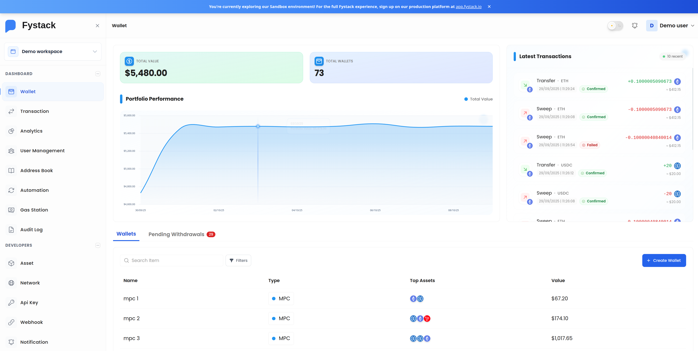
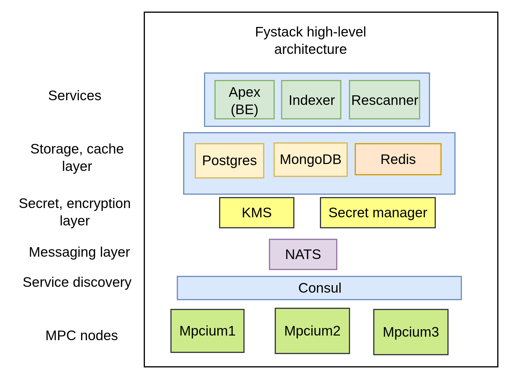
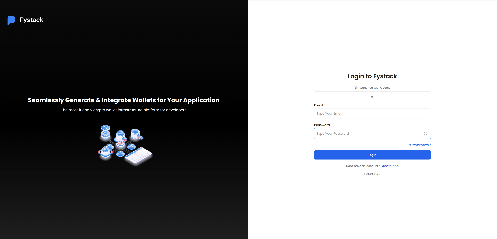

# Fystack Self-host Quick Start Guide

Welcome to **Fystack**! This guide will help you get up and running quickly with our infrastructure, including:

- **Apex**: The backend core API
- **MPCIUM**: Self-hosted MPC nodes for secure signing and key management

---

## Overview



Fystack is a modular, self-hosted MPC wallet infrastructure designed to help you integrate threshold cryptography securely and easily into your custody system.

**This quick start guide helps developers and teams bootstrap a complete Fystack testnet environment with a single shell script command (`./fystack-ignite.sh`).** By setting up Fystack locally, you can:

- **Understand the Fystack architecture** hands-on with all core components running
- **Set up your local development environment quickly** without manual service configuration
- **Test and explore** MPC wallet features on testnet before production deployment

This guide will walk you through running the **backend API** and a **local MPCIUM cluster** in minutes.

---

## Components



### 1. Apex (Backend Core)

The API backend that handles:

- Wallet and User management
- Key orchestration and policy enforcement
- Audit logging
- API Keys
- Transaction indexing

### 2. MPCIUM (MPC Nodes)

Each node runs part of the threshold signing/keygen logic (based on Binance's `tss-lib`) and communicates securely with Apex and otherpeers.

### 3. Multichain Indexer

Indexes the latest blocks from the blockchain in real-time, keeping track of on-chain transactions and events relevant to your wallets.

### 4. Rescanner

Reindexes block gaps to ensure complete blockchain data coverage, filling in any missing blocks or transactions that may have been skipped during initial indexing.

---

## Prerequisites

- Docker and Docker Compose installed
- Bash shell
- Internet connection
- Recommended system: 8v CPU, 16GB RAM

## Quick Start Steps

### 1. Docker Login

First, authenticate with the Fystack Labs Docker registry:

```bash
docker login -u fystacklabs
```

When prompted, enter your password.

> **Need the Docker password?** Join the Fystack Telegram community to get access:
>
> [](https://t.me/+IsRhPyWuOFxmNmM9)

### 2. Copy config files from the template

```
cp ./dev/config.yaml.template ./dev/config.yaml
cp ./dev/config.rescanner.yaml.template ./dev/config.rescanner.yaml
cp ./dev/config.indexer.yaml.template ./dev/config.indexer.yaml
```

Open the `config.yaml`, `config.rescanner.yaml`, and `config.indexer.yaml` files in your text editor and update the configuration values as needed.

### 3. Make Start Script Executable

Change to the root directory, make the start script executable.
Make sure you are at the root folder of the project

```bash
chmod +x ./fystack-ignite.sh
```

### 4. Start the Fystack Cluster

Run the complete setup and startup script at the root folder of the project.

```bash
./fystack-ignite.sh
```

This script will automatically:

- Generate MPCIUM node configurations
- Start all Docker Compose services
- Extract encryption keys
- Configure and restart the Apex service

Services started include:

- **NATS messaging server** (port 4223)
- **Consul service discovery** (port 8501)
- **PostgreSQL database** (port 5433)
- **Redis** (port 6380)
- **MongoDB** (port 27018)
- **Apex API** (port 8150)
- **3 MPC nodes** (node0, node1, node2)
- **Automatic peer registration**

### 5. Visit the Fystack Portal

Once all services are running, you can access the Fystack portal at [http://localhost:8015](http://localhost:8015)



### 6. Verify the Setup

Check that all services are running:

```bash
docker compose -f ./dev/docker-compose.yaml ps
```

You should see all services in the "Up" state.

### 5. View Logs (Optional)

Monitor the cluster logs:

```bash
# View all service logs
docker compose -f ./dev/docker-compose.yaml logs -f

# View logs from a specific node
docker compose -f ./dev/docker-compose.yaml logs -f mpcium-node0
```

## What's Running

Your Fystack cluster includes:

> **Note:** PostgreSQL, Redis, MongoDB, NATS, and Consul ports have been increased by 1 to avoid conflicts with your development environment. All ports are bound to 127.0.0.1 (localhost) for security.

| Service                  | Purpose                                      | Port  |
| ------------------------ | -------------------------------------------- | ----- |
| **NATS Server**          | Messaging layer for node communication       | 4223  |
| **Consul**               | Service discovery and health checks          | 8501  |
| **PostgreSQL**           | Database for custody operations              | 5433  |
| **Redis**                | In-memory data store                         | 6380  |
| **MongoDB**              | Document database                            | 27018 |
| **Apex API**             | Main API service                             | 8150  |
| **Migrate**              | Database migration service                   | -     |
| **Rescanner**            | Reindexes block gaps for complete data       | -     |
| **Multichain Indexer**   | Indexes blockchain transactions in real-time | -     |
| **Fystack UI Community** | Community web interface for Fystack          | 8015  |
| **MPC Node 0**           | First MPC node                               | 8080  |
| **MPC Node 1**           | Second MPC node                              | 8081  |
| **MPC Node 2**           | Third MPC node                               | 8082  |
| **MPCIUM Init**          | Peer registration service                    | -     |

## E2E Testing

Once your Fystack cluster is running, you can test the wallet creation flow using the provided end-to-end test script.

### 1. Make Test Script Executable

Make the E2E test script executable:

```bash
chmod +x ./e2e/create-wallet.sh
```

### 2. Run the E2E Test

Execute the wallet creation test:

```bash
./e2e/create-wallet.sh
```

This script will:

- Register a test user
- Sign in and create a workspace
- Start a session
- Create an MPC wallet

### 3. Check Apex API Logs

Monitor the Apex API logs to verify successful wallet creation:

```bash
docker compose -f ./dev/docker-compose.yaml logs -f apex
```

**Expected successful output:**

```
3:15AM INF Enqueueing message
3:15AM INF Message published message len=407 topic=auditlog.event.dispatch
3:15AM INF Received message meta={"Consumer":"event","Domain":"","NumDelivered":1,"NumPending":0,"Sequence":{"consumer_seq":2,"stream_seq":2},"Stream":"auditlog","Timestamp":"2025-08-06T03:15:55.887251886Z"}
3:15AM INF Message Acknowledged meta={"Consumer":"event","Domain":"","NumDelivered":1,"NumPending":0,"Sequence":{"consumer_seq":2,"stream_seq":2},"Stream":"auditlog","Timestamp":"2025-08-06T03:15:55.887251886Z"}
3:15AM INF Received message meta={"Consumer":"mpc_keygen_result","Domain":"","NumDelivered":1,"NumPending":0,"Sequence":{"consumer_seq":1,"stream_seq":1},"Stream":"mpc","Timestamp":"2025-08-06T03:15:59.081703423Z"}
3:15AM INF Process MPC generation successfully walletID=a8f47f60-540d-4d23-8743-6fd8b5abe5ce
3:15AM INF Message Acknowledged meta={"Consumer":"mpc_keygen_result","Domain":"","NumDelivered":1,"NumPending":0,"Sequence":{"consumer_seq":1,"stream_seq":1},"Stream":"mpc","Timestamp":"2025-08-06T03:15:59.081703423Z"}
```

### 4. Check MPC Node Logs

Verify the MPC key generation process on any node (e.g., node0):

```bash
docker compose -f ./dev/docker-compose.yaml logs -f mpcium-node0
```

**Expected successful output:**

```
2025-08-06 03:15:55.000 INF Initializing session with partyID: {1,keygen}, peerIDs [{0,keygen} {1,keygen} {2,keygen}]
2025-08-06 03:15:55.000 INF [INITIALIZED] Initialized session successfully partyID: {1,keygen}, peerIDs [{0,keygen} {1,keygen} {2,keygen}], walletID a8f47f60-540d-4d23-8743-6fd8b5abe5ce, threshold = 2
2025-08-06 03:15:55.000 INF Initializing session with partyID: {1,keygen}, peerIDs [{0,keygen} {1,keygen} {2,keygen}]
2025-08-06 03:15:55.000 INF [INITIALIZED] Initialized session successfully partyID: {1,keygen}, peerIDs [{0,keygen} {1,keygen} {2,keygen}], walletID a8f47f60-540d-4d23-8743-6fd8b5abe5ce, threshold = 2
2025-08-06 03:15:56.000 INF Starting to generate key ECDSA walletID=a8f47f60-540d-4d23-8743-6fd8b5abe5ce
2025-08-06 03:15:56.000 INF Starting to generate key EDDSA walletID=a8f47f60-540d-4d23-8743-6fd8b5abe5ce
2025-08-06 03:15:59.000 INF Publishing message consumerName=mpc_keygen_result topic=mpc.mpc_keygen_result.a8f47f60-540d-4d23-8743-6fd8b5abe5ce
2025-08-06 03:15:59.000 INF [COMPLETED KEY GEN] Key generation completed successfully walletID=a8f47f60-540d-4d23-8743-6fd8b5abe5ce
```

The successful completion of these logs indicates that your MPC wallet has been created and the key generation process completed across all nodes.

## Update version

To update version of a component (New docker image version)

```
cd dev
docker compose pull apex
docker compose up -d --no-deps --force-recreate apex
```
