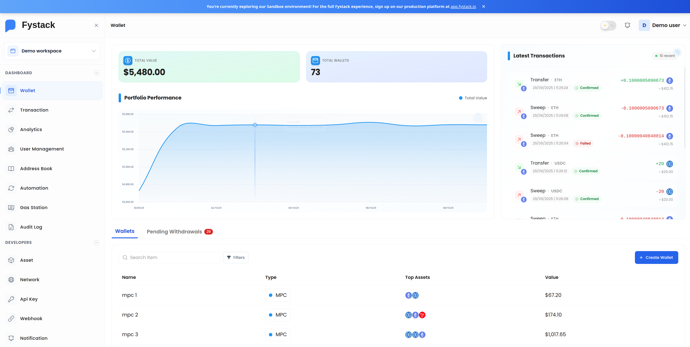
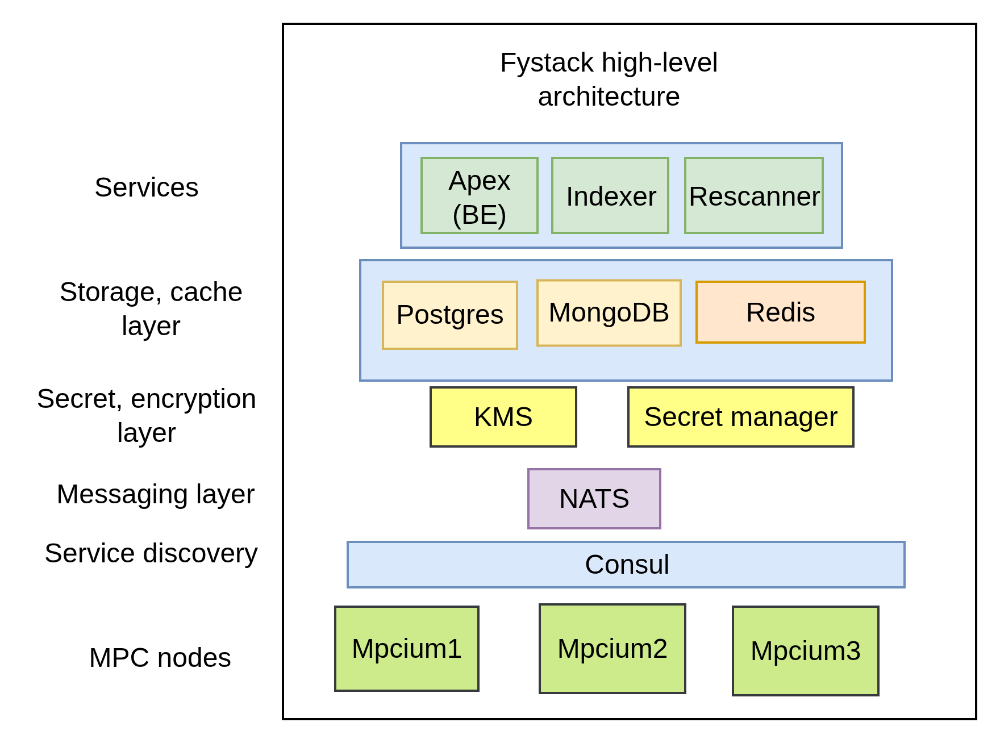
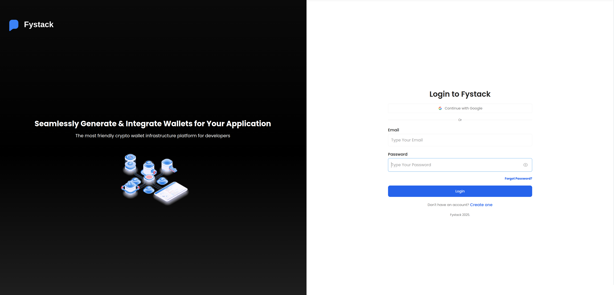

# Fystack Self-host Quick Start Guide

Welcome to **Fystack**! This guide helps you get up and running with the self-hosted infrastructure:

- **Apex**: The backend core API
- **MPCIUM**: Self-hosted MPC nodes for secure threshold signing and key management

## Platform Support

| Platform | Status |
|----------|--------|
| **Linux** | Fully supported |
| **macOS** | Fully supported (requires Docker Desktop) |
| **Windows** | Supported via WSL2 (see below) |

---

## Overview



**Fystack** is a self-hosted custodial wallet platform built on **MPC (Multi-Party Computation)** so you can run secure threshold cryptography on hardware you control—no third-party custody required.

With Fystack you keep full ownership of:

- **MPC nodes** that handle distributed keygen and signing
- **Key material and policies** with no external dependencies
- **Threshold signature security** that scales across on-prem and private cloud setups

---

## Components



### 1. Apex (Backend Core)

The API backend that handles:

- Wallet and user management
- Key orchestration and policy enforcement
- Audit logging
- API keys
- Transaction indexing

### 2. MPCIUM (MPC Nodes)

Each node runs part of the threshold signing/keygen logic (based on Binance's `tss-lib`) and communicates securely with Apex and other peers.

### 3. Multichain Indexer

Indexes the latest blocks from the blockchain in real-time, keeping track of on-chain transactions and events relevant to your wallets.

### 4. Rescanner

Reindexes block gaps to ensure complete blockchain data coverage, filling in any missing blocks or transactions that may have been skipped during initial indexing.

---

## Prerequisites

- Docker and Docker Compose installed and running
- Go 1.26 or newer (for the CLI)
- Internet connection
- Recommended system: 4 vCPU, 4 GB RAM

### Windows (WSL2)

> **Non-Windows users can skip this section.**

Windows users must run everything inside **WSL2** (Windows Subsystem for Linux).

**1. Install WSL2**

Open PowerShell as Administrator and run:

```powershell
wsl --install
```

Restart when prompted. This installs WSL2 with Ubuntu by default.

**2. Install Docker Desktop for Windows**

Download [Docker Desktop](https://www.docker.com/products/docker-desktop/). During setup, ensure **"Use the WSL 2 based engine"** is checked. Then go to **Settings > Resources > WSL Integration** and enable it for your distro.

**3. Open a WSL2 terminal**

All subsequent commands must be run from a WSL2 terminal, not from PowerShell or CMD.

```bash
wsl
```

---

## Install the CLI

The `fystack` CLI manages the entire stack lifecycle: setup, deploy, status, updates, and reset.

### Option 1 — Install binary (recommended)

```bash
go install github.com/fystack/fystack-selfhost-scripts/cmd/fystack@latest
```

This places the `fystack` binary in `$GOPATH/bin` (typically `~/go/bin`). Make sure that directory is on your `$PATH`:

```bash
export PATH="$PATH:$(go env GOPATH)/bin"
```

Verify:

```bash
fystack version
```

### Option 2 — Build from source

```bash
git clone git@github.com:fystack/fystack-selfhost-scripts.git
cd fystack-selfhost-scripts
go build -o fystack ./cmd/fystack
sudo mv fystack /usr/local/bin/
```

Verify:

```bash
fystack version
```

### Option 3 — Run directly with `go run`

If you don't want to install a binary, run commands directly from the repository root:

```bash
go run ./cmd/fystack <command>
```

All examples in this guide use `fystack <command>`. Substitute `go run ./cmd/fystack <command>` if you are using Option 3.

---

## Quick Start

> **📺 Video Tutorial:** Watch the complete setup walkthrough on YouTube:
>
> [](https://www.youtube.com/watch?v=AjY9t7orbs4)

### 1. Clone the Repository

```bash
git clone git@github.com:fystack/fystack-selfhost-scripts.git
cd fystack-selfhost-scripts
```

### 2. Docker Login

Authenticate with the Fystack Labs Docker registry:

```bash
docker login -u fystacklabs
```

> **Need the Docker password?** Join the Fystack Telegram community to get access:
>
> [](https://t.me/+9AtC0z8sS79iZjFl)

### 3. Run Guided Setup

The single `setup` command handles everything interactively:

```bash
fystack setup
```

It will:

- Create dev config files from templates (or ask to overwrite if they already exist)
- Let you choose Binance (no API key) or CoinMarketCap as the price provider
- Generate MPC node configs using the bundled `mpcium-cli` container
- Optionally deploy the dev stack immediately

### 4. Deploy (if you skipped it in setup)

```bash
fystack deploy --env dev
```

### 5. Visit the Fystack Portal

Once all services are running, open the portal at [http://localhost:8015](http://localhost:8015)



### 6. Verify the Setup

```bash
fystack status --env dev
```

---

## CLI Reference

```bash
fystack setup                        # Guided first-time setup
fystack doctor --env dev             # Check prerequisites and required files
fystack init --env dev               # Generate MPC node configs
fystack deploy --env dev             # Deploy the Docker Compose stack
fystack status --env dev             # Show running service status
fystack restart --env dev            # Restart services (interactive selector)
fystack restart apex rescanner       # Restart specific services
fystack logs --env dev               # Show recent logs (all services)
fystack logs apex --tail 500         # Show logs for one service
fystack check-updates --env dev      # Check for newer image tags
fystack update --env dev --all       # Update all app image pins
fystack update --env dev --all --deploy  # Update pins and redeploy
fystack reset                        # Remove all generated files (clean slate)
fystack version                      # Print CLI version
```

See [CLI_USAGE.md](CLI_USAGE.md) for the full command reference, flags, and troubleshooting notes.

---

## What's Running

> **Note:** PostgreSQL, Redis, MongoDB, NATS, and Consul ports are offset by 1 to avoid conflicts with your local dev environment. All ports are bound to `127.0.0.1`.

| Service                  | Purpose                                      | Port  |
|--------------------------|----------------------------------------------|-------|
| **NATS Server**          | Messaging layer for node communication       | 4223  |
| **Consul**               | Service discovery and health checks          | 8501  |
| **PostgreSQL**           | Database for custody operations              | 5433  |
| **Redis**                | In-memory data store                         | 6380  |
| **MongoDB**              | Document database                            | 27018 |
| **Apex API**             | Main API service                             | 8150  |
| **Migrate**              | Database migration service                   | —     |
| **Rescanner**            | Reindexes block gaps for complete data       | —     |
| **Multichain Indexer**   | Indexes blockchain transactions in real-time | —     |
| **Fystack UI Community** | Community web interface                      | 8015  |
| **MPC Node 0**           | First MPC node                               | 8080  |
| **MPC Node 1**           | Second MPC node                              | 8081  |
| **MPC Node 2**           | Third MPC node                               | 8082  |

---

## E2E Testing

Once the stack is running, test the wallet creation flow:

```bash
./e2e/create-wallet.sh
```

This script registers a test user, signs in, creates a workspace and session, and creates an MPC wallet.

### Check Apex logs after the test

```bash
fystack logs apex --env dev
```

**Expected output:**

```
3:15AM INF Process MPC generation successfully walletID=a8f47f60-...
```

### Check MPC node logs

```bash
fystack logs mpcium0 --env dev
```

**Expected output:**

```
INF [COMPLETED KEY GEN] Key generation completed successfully walletID=a8f47f60-...
```

---

## Deploying on a VPS / Reverse Proxy

By default, the Fystack UI connects to the Apex API at `http://localhost:8150`. When deploying on a VPS behind a reverse proxy, set `API_BASE_URL` so the UI can reach the API.

**Option 1: Export before deploy**

```bash
export API_BASE_URL=https://api.yourdomain.com
fystack deploy --env dev
```

**Option 2: `.env` file in `dev/`**

```bash
echo "API_BASE_URL=https://api.yourdomain.com" > dev/.env
fystack deploy --env dev
```

### Changing the API URL later

```bash
export API_BASE_URL=https://new-domain.com
docker compose -f ./dev/docker-compose.yaml up -d --force-recreate fystack-ui-community
```

---

## Updating Images

Check for newer app image versions:

```bash
fystack check-updates --env dev
```

Update all available semver-tagged services and redeploy:

```bash
fystack update --env dev --all --deploy
```

Update specific services:

```bash
fystack update --env dev apex mpcium
fystack deploy --env dev
```

---

## Resetting to a Clean State

To remove all generated files and return the repository to a freshly-cloned state:

```bash
fystack reset
```

This removes `dev/config.yaml`, `dev/config.rescanner.yaml`, `dev/config.indexer.yaml`, `dev/node-configs/`, and `.fystack.compose.env`. Templates and source files are never touched. After a reset, run `fystack setup` to start fresh.

---

## ⚠️ Important Notice

> **WARNING: This setup is for testing environments only.**
>
> For **manual deployment, Docker Compose, or Kubernetes deployment** for **maximum security**, please contact the **Fystack team** for enterprise-grade deployment guidance.
>
> [](https://t.me/+IsRhPyWuOFxmNmM9)
